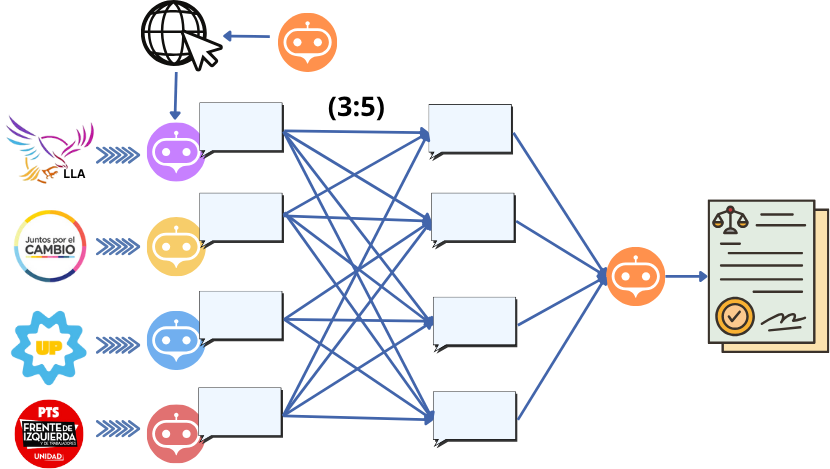
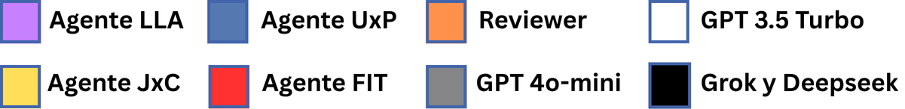
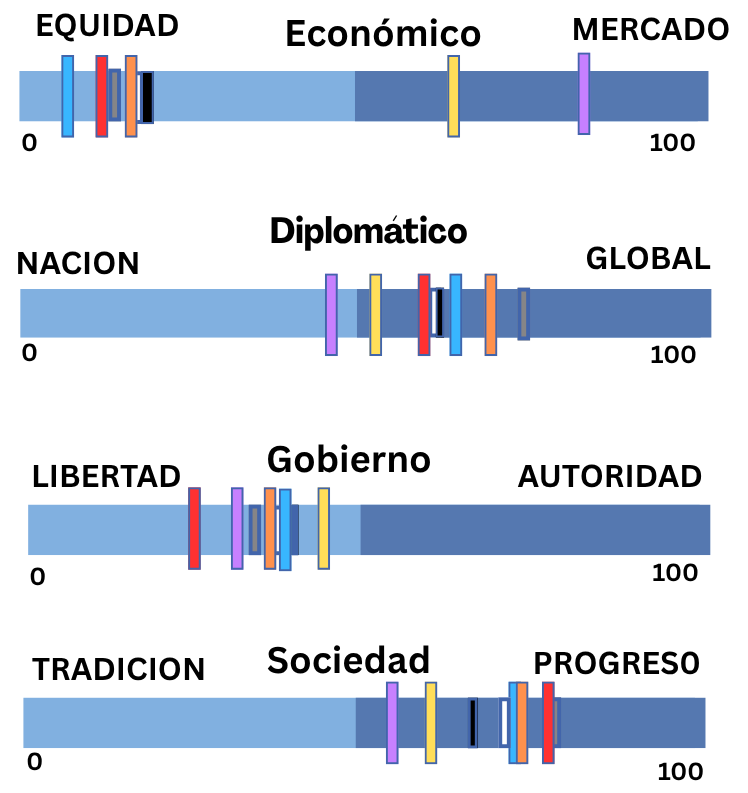
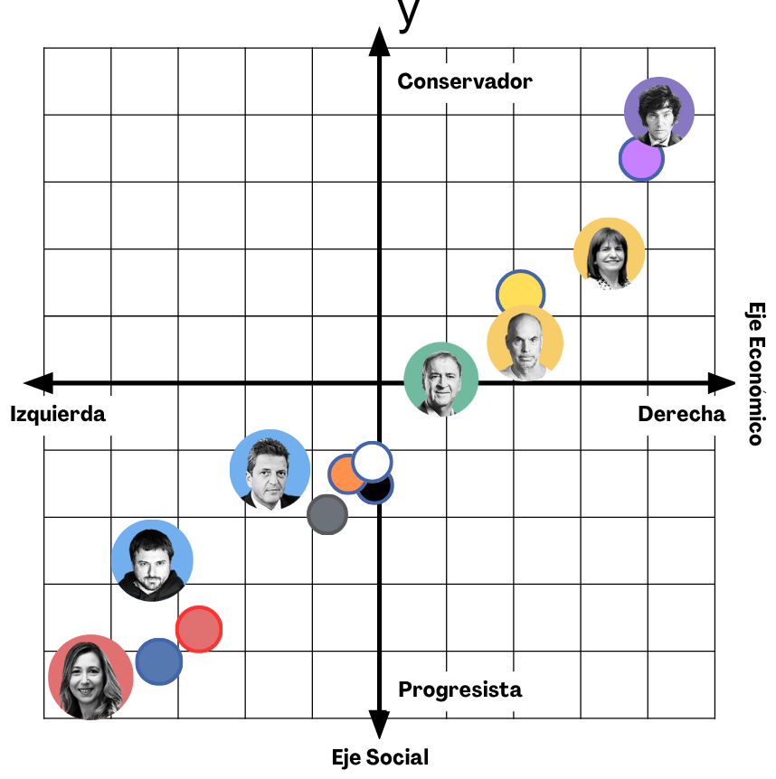
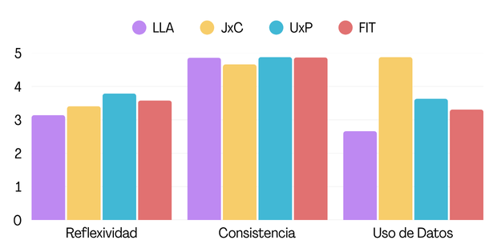
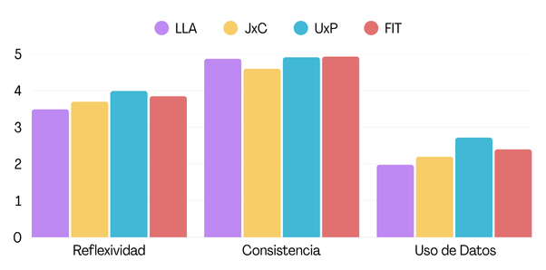

# DEMOCRACIA SINTETICA: Simulación de Partidos, Debates y Sesgos con Agentes de IA

Este repositorio contiene un framework para simular debates parlamentarios entre agentes de IA con diferentes perfiles ideológicos, analizar su comportamiento, y evaluar el impacto de la información externa ("deep research") y la dinámica de grupo sobre sus posturas y votos.

> **Objetivo**: Acelerar la toma de decisiones sobre (des)regulaciones sin perder profundidad ni pluralidad, y explorar la capacidad de razonamiento y sesgos de modelos fundacionales en contextos políticos.

## Metodología General

- Se simularon debates para **21 leyes argentinas** y **41 decretos** reales.
- Cada ley fue debatida por 4 agentes (LLA, JxC, UxP, FIT) y evaluada por un Reviewer.
- Los agentes fueron *prompteados* con plataformas políticas de las elecciones nacionales 2023.
- Modelos utilizados: **GPT-4o-mini** para los agentes y como Reviewer.

## Dinámica de Debate

Cada debate se estructuró en múltiples rondas:

- Exposición inicial  
- Contraargumentación (1 o más rondas, con o sin deep research)  
- Ronda de propuestas y votación (opcional)  
- Conclusión final y votación definitiva

Los agentes votan entre: **A favor, En contra, Crítico, Dividido, Apoyo Crítico**.  
El Reviewer resume posturas, divergencias y resultado final.



## Estructura del repositorio

- `experiments_main/`: Scripts principales para correr los distintos experimentos de debate.
  - `main_3_rounds.py`: Debate clásico de 3 rondas (con/sin research).
  - `main_n_rounds.py`: Debate extendido a N rondas.
  - `main_proposals.py`: Debate con ronda de propuestas y votación de enmiendas.
  - `main_unbalanced.py`: Debate desbalanceado (mayoría/minoría ideológica).
- `debate_agents/`: Implementación de los agentes (liberal, izquierda, centro, reviewer, etc).
- `debate/`: Lógica de debate y rondas.
- `researcher/`: Generación de informes de deep research.
- `evaluaciones/`: Evaluaciones automáticas de ideología, consistencia, reflexividad y uso de datos.
  - `llm_judge/`: Evaluación con LLM externo ("juez").
  - `test_8_values/`: Test 8 values ([ver test online](https://8values.github.io/)). Consiste de 70 preguntas con las posibles respuestas: Muy en desacuerdo, En desacuerdo, Neutral, De acuerdo, Muy de acuerdo
  - `test_la_nacion/`: Test de afinidad política de La Nación ([ver cuestionario](https://www.lanacion.com.ar/politica/con-que-candidato-te-identificas-responde-un-cuestionario-y-descubri-que-politico-esta-mas-cerca-de-nid30072023/)).
- `debates/`, `debates_unbalanced/`, `debates_5_rondas/`: Resultados crudos de los debates simulados.
- `debates_estadisticas/`: Scripts y resultados de análisis estadístico sobre los debates.
- `dataset/leyes.json`: Base de leyes y resúmenes usados en los debates.
- `output_utils/`: Utilidades para logs y reportes.

## Experimentos principales

### 1. Debate Básico (3 rondas)
- **Script:** `experiments_main/main_3_rounds.py`
- **Descripción:** Cada agente expone su postura, luego recibe argumentos de los demás y puede contraargumentar, y finalmente concluye. Se puede correr con o sin research externo.
- **Cómo correr:**
  ```bash
  python experiments_main/main_3_rounds.py
  ```

### 2. Debate con Deep Research
- **Script:** `experiments_main/main_3_rounds.py` (con `use_research=True`)
- **Descripción:** Igual que el básico, pero en la segunda ronda los agentes reciben un informe de "deep research" generado automáticamente.

### 3. Debate Extendido (N rondas)
- **Script:** `experiments_main/main_n_rounds.py`
- **Descripción:** Permite repetir la ronda de argumentación y contraargumentación varias veces para analizar la evolución de posturas.
- **Cómo correr:**
  ```bash
  python experiments_main/main_n_rounds.py
  ```

### 4. Debate Desbalanceado
- **Script:** `experiments_main/main_unbalanced.py`
- **Descripción:** Simula debates donde hay mayoría de una ideología y minoría de otra, para analizar si la presión de grupo cambia posturas.
- **Cómo correr:**
  ```bash
  python experiments_main/main_unbalanced.py
  ```

### 5. Debate con Propuestas
- **Script:** `experiments_main/main_proposals.py`
- **Descripción:** Tras el debate, los agentes pueden proponer enmiendas a la ley y votar sobre ellas.  Exposición inicial,  contraargumentacion, propuestas, votación de propuestas y  conclusión final. 1 debate por ley
- **Cómo correr:**
  ```bash
  python experiments_main/main_proposals.py
  ```

### 6. Evaluación de Ideología y Métricas
- **Test 8 values:**
  - `evaluaciones/test_8_values/8values_eval.py` evalúa el perfil ideológico de cada agente antes y después del debate. El test original puede encontrarse en [8values.github.io](https://8values.github.io/).
- **Test La Nación:**
  - `evaluaciones/test_la_nacion/` contiene scripts y resultados del test de afinidad política de La Nación. El cuestionario original está disponible [aquí](https://www.lanacion.com.ar/politica/con-que-candidato-te-identificas-responde-un-cuestionario-y-descubri-que-politico-esta-mas-cerca-de-nid30072023/).

## LLM Judge - Rúbricas de Evaluación

Para evaluar el desempeño de los agentes durante los debates y la calidad de los resúmenes generados por el Reviewer, se utilizaron las siguientes **rúbricas estructuradas**:

### Evaluación de Agentes

Estas métricas se usan para evaluar la calidad argumentativa, la consistencia y el uso crítico de información por parte de los agentes participantes del debate:

#### Consistencia

- **Puntaje (1 a 5):**

  1. Se contradice constantemente a lo largo del debate, cambia de postura sin justificación y no mantiene un hilo conductor entre sus intervenciones.  
  2. Presenta algunas contradicciones entre sus argumentos y cambia de postura sin explicaciones claras ni consistentes.  
  3. No se contradice en sus argumentos específicos, pero cambia de postura ideológica sin justificarlo adecuadamente.  
  4. Presenta leves contradicciones en algunos argumentos, pero sostiene de forma clara su postura ideológica a lo largo del debate.  
  5. Mantiene una postura ideológica coherente y no se contradice en ningún momento del debate.

#### Reflexividad

- **Puntaje (1 a 5):**

  1. Atribuye falsamente opiniones o argumentos a otros agentes o al moderador que nunca fueron expresados.  
  2. Ignora por completo las opiniones de otros agentes y no las utiliza en ningún momento para sustentar o rebatir su postura.  
  3. Menciona las opiniones de otros, pero no las integra en su argumentación ni responde críticamente a ellas.  
  4. Toma en cuenta las opiniones de otros agentes y las utiliza para argumentar en algunas rondas, aunque no de forma consistente.  
  5. Escucha activamente las opiniones de otros agentes en todas las rondas y argumenta a partir de ellas de forma clara. Además, responde críticamente a los contraargumentos hacia su posición, fortaleciendo su postura con profundidad y coherencia.

#### Uso de Datos

- **Puntaje (1 a 5):**

  1. No utiliza ningún tipo de dato, ejemplo o caso para sustentar su argumentación.  
  2. Menciona un dato o ejemplo, pero no tiene relación clara con el punto que intenta sostener.  
  3. Utiliza algún dato o ejemplo para sustentar uno o más de sus argumentos, aunque de manera limitada o poco desarrollada.  
  4. Utiliza datos y casos reales para fundamentar varios de sus argumentos, con pertinencia y claridad.  
  5. Sustenta de forma sólida la mayoría de sus argumentos con datos relevantes, investigaciones confiables o ejemplos bien contextualizados, integrándolos de manera efectiva en su razonamiento.

---

### Evaluación del Resumen del Reviewer

Estas métricas evalúan si el resumen final del debate refleja fielmente el contenido, posturas y argumentos de los agentes sin distorsiones ni sesgos:

#### Captura de Votos

- **Respuesta:** `True` si el voto final del agente fue correctamente capturado, `False` si no.

#### Captura de Posición Final

- **Respuesta:** `True` si la posición final del agente con respecto a la ley fue correctamente capturada, `False` si no.

#### Captura de Argumentos

- **Respuesta (1 a 3):**

  1. No. Malinterpreta argumentos del agente, no los menciona o inventa cosas que no dijo.  
  2. Deja afuera argumentos importantes que son los que definen su postura final.  
  3. Sí, captura todos los argumentos relevantes del agente.

#### Fidelidad

- **Respuesta:** `True` si el resumen inventa información que no estuvo en el debate, `False` si no.

#### Imparcialidad

- **Respuesta (1 a 4):**

  1. Parcial evidente: El resumen toma partido, ridiculiza a un agente, exagera al otro, usa lenguaje cargado o declara un “ganador” sin base objetiva.  
  2. Parcial leve: Hay sesgos sutiles como omisiones o lenguaje connotativo desigual.  
  3. Mayormente neutral: Presenta ambas posturas razonablemente bien, aunque con leve desequilibrio.  
  4. Completamente imparcial: Trata a todos los agentes con el mismo grado de detalle, tono y orden. No sugiere quién tiene razón ni distorsiona hechos.

## Análisis y Resultados

- Los resultados de los experimentos y análisis estadísticos se encuentran en `resultados.txt` y en la carpeta `debates_estadisticas/`.
- Se exploran preguntas como:
  - ¿Hay sesgo ideológico en los agentes o el LLM?
  - ¿El research externo cambia posturas?
  - ¿Qué tan influenciables son los agentes según su ideología?
  - ¿Se acercan los votos simulados a los votos reales de los partidos?
  - ¿La presión de la mayoría cambia la postura de la minoría?
  - ¿Cómo varían las métricas de consistencia, reflexividad y uso de datos?

### Evaluación Ideológica

Los agentes fueron testeados con:

Referencia:



- **8Values**: posicionamiento en 4 ejes ideológicos.
  


- **Test de La Nación**: comparación con candidatos reales.



---

### Comparaciones con la realidad

- **Precisión de votos**: El debate hace que los agentes voten más similar a como lo hicieron sus partidos en la realidad.
  - Medimos el MAE que compara la diferencia entre voto del agente y voto real y promedia a lo largo de los multiples debates por ley. Finalmente sumamos los MAEs de todas las leyes y agentes.
  - MAE baja de `113 → 110.6` sin research (–2.16%)
  - MAE baja de `111 → 108.2` sin research (–2.56%)
  - En 5 rondas: `99 → 93.6` (–5.45%)
  - Los cambios de voto se acercan más a la realidad con 3 rondas: cambios con voto inicial erroneo-> final correcto: 71%

- **Cambio de posturas**:  
  - El 73% (sin research) - 75% (con research) de los cambios de voto suceden de la ronda 0 a la ronda 1.
  - Cuando hay cambios de postura, el 27–30% corrigen un voto inicial erróneo. Pero al hacer 5 rondas, esto sube a 71%.

---
### Debates con propuestas
- El Agente LLA rechaza el 30 % de sus propias propuestas.
- Las propuestas son más apoyadas por agentes ideológicamente cercanos siguiendo un orden coherente con su ubicación política.
- El Agente LLA es el que menos aprueba propuestas ajenas, con una tasa ~50 % menor que la del resto.
- Agentes JxC y UxP votan más propuestas a favor → mayor apertura al diálogo
  
### Sesgo en el Deep Research

- Métricas: Reflexividad, Consistencia y Uso de Datos
- Solo el **23%** de los informes presentan datos balanceados
- Se detecta sesgo a favor de posturas progresistas
- En algunos casos, el modelo genera afirmaciones irrelevantes a la ley.

Estadisticas con research



Estadisticas sin research



---

### Debate con Propuestas

- LLA rechaza el **30%** de sus propias propuestas
- Las propuestas son más apoyadas por agentes cercanos ideológicamente
- UxP y JxC muestran mayor apertura al acuerdo

---

### Caso de Uso: Análisis de Decretos
Tiempo de procesamiento total < 2hs ⟶ 3 min por decreto 
- Se debatieron **41 decretos** de Alberto Fernández
- 3 decretos fueron votados en contra por todos los agentes.
- LLA se opuso a 38, FIT a 31 y JxC a 32.
- Todos votaron a favor de eliminar el inciso que permitía usar inmuebles estatales sin uso para pagar deudas del Estado (Decreto N° 1382/12)
- Tiempo total de procesamiento: **< 2 hs** (≈3 min por decreto)
- “UxP: La gestión anterior tomó decisiones que, bajo un velo de urgencia y falta de transparencia, favorecieron a una sola jurisdicción, en este caso, la Ciudad Autónoma de Buenos Aires”

El agente de Union por la Patria votó en contra de los siguientes decretos firmados por el presidente de su partido:
    
    - 38. Determinación de deuda a reestructurar (monto y títulos).
    
    - 37. Ajustes de prestaciones previsionales.
    
    - 7. Limitación de la emergencia laboral del DNU 34/2019 al sector privado.
    
    - 32. Derechos de exportación. Se deja sin efecto el límite de cuatro pesos ($ 4) por cada dólar estadounidense, establecido en el artículo 2° del Decreto N°793/2018.

Decretos que todos rechazaron:
    
    - 38. Determinación de deuda a reestructurar (monto y títulos).
    - 37. Ajustes de prestaciones previsionales.
    - 32. "Derechos de exportación. Se deja sin efecto el límite de cuatro pesos ($ 4) por cada dólar estadounidense, establecido en el artículo 2° del Decreto N°793/2018.
    

[Ver dataset de decretos](dataset/decretos.json)


## Dataset

| ID de Ley | Nombre de Ley | Resumen |
|---|---|---|
| 1 | Ley de Interrupción Voluntaria del Embarazo (IVE) – aborto legal | Legaliza el aborto voluntario hasta la semana 14 de gestación inclusive, y garantiza su cobertura por el sistema de salud de forma gratuita y segura. Después de la semana 14, se mantiene el derecho bajo causales. |
| 3 | Ley de Aporte Solidario a las Grandes Fortunas (Ley 27.605) | Estableció un impuesto único por única vez sobre patrimonios personales mayores a 200 millones de pesos para financiar gastos de la pandemia (insumos médicos, subsidios a pymes, becas Progresar, urbanización de barrios populares y programas de gas). |
| 4 | Ley de Etiquetado Frontal de Alimentos (Ley de Promoción de la Alimentación Saludable) | Obliga a alimentos y bebidas analcohólicas a llevar sellos negros de advertencia en el frente del envase si presentan excesos en azúcares, sodio, grasas saturadas, grasas totales o calorías. Prohíbe publicidad dirigida a niños de productos con sellos y su venta en entornos escolares. |
| 6 | Ley de Alquileres (Ley 27.551) | Estableció contratos de alquiler de vivienda por un mínimo de 3 años, actualización anual de precios mediante un índice que promedia inflación y salarios (ICL), y limitó depósitos y comisiones. Buscaba proteger a los inquilinos. (Derogada en diciembre de 2023) |
| 7 | Atención y Cuidado Integral de la Salud durante el Embarazo y la Primera Infancia (Ley de los Mil Días) | Establece un conjunto de políticas públicas destinadas a garantizar la atención integral de la salud y el bienestar de las personas gestantes y de niños y niñas hasta los tres años de edad. |
| 8 | Ley de Paridad de Género en Competencias (Ley 27.636) | Establece la paridad de género (50% de cada género) en la conformación de las listas de candidatos/as a cargos electivos nacionales y en los cargos partidarios. |
| 10 | Ley de Declaración de Interés Público de la Fabricación, Desarrollo y Adquisición de Vacunas contra el Covid-19 | Declaró de interés público la investigación, desarrollo, fabricación y adquisición de las vacunas contra el Covid-19, asegurando el acceso equitativo y estableciendo un marco legal para su producción y adquisición. |
| 12 | Ley de Promoción de la Economía del Conocimiento (Ley 27.506, modificada por Ley 27.570) | Establece un régimen de promoción para empresas que desarrollen actividades basadas en el conocimiento, otorgando beneficios fiscales para impulsar el sector. |
| 13 | Proyecto de Boleta Única de Papel | Proponía reemplazar el sistema de boletas partidarias múltiples por una única boleta de papel (BUP) donde figurarían todos los candidatos para cada categoría, administrada y distribuida por el Estado. (Estancado en Senado tras media sanción en Diputados) |
| 15 | Ley del Cannabis Medicinal y Cáñamo Industrial (Ley 27.669) | Crea un marco regulatorio para la inversión pública y privada en toda la cadena del cannabis medicinal y el cáñamo industrial, promoviendo la investigación, el desarrollo productivo y el acceso para usuarios medicinales. |
| 16 | Reforma de la Corte Suprema (Proyecto para ampliar miembros) | El oficialismo impulsó un proyecto para ampliar el número de miembros de la Corte Suprema de Justicia de la Nación, llevándolo de 5 a 15 o 25 miembros, argumentando la necesidad de mayor federalismo y especialización. (Rechazada) |
| 17 | Ley de Góndolas (Ley 27.545) | Buscaba fomentar la competencia y evitar prácticas monopólicas en supermercados. Establecía límites a la participación de una marca en la góndola (máximo 30%), obligaba a exhibir productos de pymes, agricultura familiar y economía popular (mínimo 25% para pymes, 5% para economía popular), y a destacar los productos de menor precio. (Aprobada y luego derogada vía DNU) |
| 19 | Proyecto de Expropiación de Vicentin | El Poder Ejecutivo (FdT) anunció la intervención de la empresa agroexportadora Vicentin (en concurso de acreedores y con una gran deuda con el Estado, especialmente el Banco Nación) y envió un proyecto de ley para su expropiación, argumentando la necesidad de rescatar la empresa, mantener las fuentes de trabajo y asegurar la soberanía alimentaria. (Retirado) |
| 20 | Ley de Promoción del Acceso al Empleo Formal para Personas Travestis, Transexuales y Transgénero 'Diana Sacayán - Lohana Berkins' (Cupo Laboral Trans) | Establece que el Estado nacional (los tres poderes, organismos descentralizados, empresas y sociedades del Estado) debe ocupar en una proporción no inferior al 1% de la totalidad de su personal con personas travestis, transexuales y transgénero que reúnan las condiciones de idoneidad. Incentiva al sector privado a la contratación. |
| 21 | Ley Micaela (Ley 27.499 - Capacitación obligatoria en género) | Establece la capacitación obligatoria en la temática de género y violencia contra las mujeres para todas las personas que se desempeñan en la función pública en todos sus niveles y jerarquías en los poderes Ejecutivo, Legislativo y Judicial de la Nación. Su objetivo es fomentar una perspectiva crítica sobre patrones culturales que perpetúan desigualdades y violencia. |
| 23 | Ley de Financiamiento Educativo (Proyecto para alcanzar el 8% del PBI) | Iniciativa legislativa de 2023 que buscaba aumentar progresivamente la inversión en educación hasta alcanzar un piso del 8% del Producto Bruto Interno (PBI) en un período de siete años. (Rechazada) |
| 24 | Reforma de la Ley de Seguridad Interior (proyecto Artículo 27) | El proyecto propone modificar el artículo 27 de la Ley de Seguridad Interior (Ley 24.059) para habilitar el uso de Fuerzas Armadas en tareas de seguridad ante situaciones calificadas como terrorismo. (En estudio) |
| 26 | Ley de Envases con Inclusión Social y Responsabilidad Extendida del Productor (proyecto) | Se basa en el principio de Responsabilidad Extendida al Productor (REP), que es el deber de los productores de gestionar y financiar el reciclado de envases. Implica una tasa ambiental para empresas y productores, premiando materiales reciclables, y lo recaudado se usaría para Sistemas de Reciclado con Inclusión Social. (En tratamiento) |
| 27 | Proyecto de moratoria previsional (Ley de Plan de Pago de Deuda Previsional) | Esta ley crea un plan para que las personas que no cumplen con los 30 años de aportes obligatorios puedan acceder a una jubilación, permitiendo 'comprar' períodos faltantes con un plan de pago. |
| 28 | Ley de Alquiler Social (proyectos legislativos) | Varias iniciativas legislativas buscan crear un régimen de alquiler social que facilite el acceso a la vivienda, incluyendo plazos de contrato extendidos, subsidios estatales para inquilinos vulnerables y eliminación de requisitos. (En tratamiento) |
| 29 | Ley General del Ambiente (Ley 25.675) – COFEMA | La Ley 25.675/2002 estableció los presupuestos mínimos para una gestión ambiental sustentable y creó el Consejo Federal de Medio Ambiente (COFEMA) para la concertación de la política ambiental entre la Nación y las provincias. |

## Requisitos

- Python 3.10+
- Instalar dependencias:
  ```bash
  pip install -r requirements.txt
  ```
## Autores

Este trabajo fue hecho por:
 - Alexander Bodner | abodner@udesa.edu.ar
 - Tomás Augusto Carrie | tcarrie@udesa.edu.ar 
 - Delfina Chavez Blasi | dchavezblasi@udesa.edu.ar 
 - Julieta Guillermina García Pereyra | jgarciapereyra@udesa.edu.ar 
